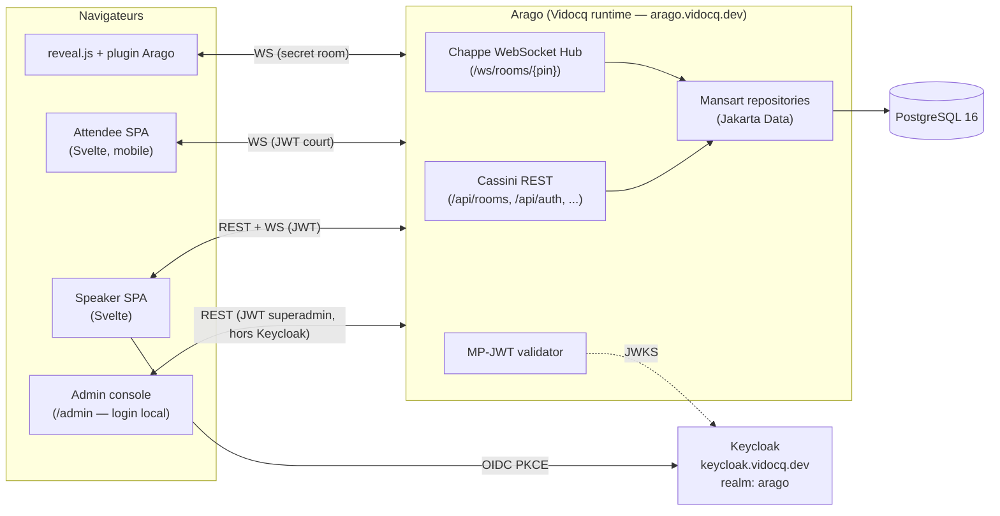

# Arago — Speaker & Lab Companion

> Première application "phare" construite sur la suite **Vidocq** (MicroProfile Server).
> Tool d'accompagnement temps réel pour speakers de conférences et animateurs de hands-on labs.

---

## 1. Contexte & vision

**Arago** est l'application de référence (showcase + dogfood) bâtie sur Vidocq / Vauban / Cassini / Chappe / Champollion / Mansart. Elle doit :

1. Démontrer en production réelle (Devoxx, JUG, JavaOne, hack labs) ce que Vidocq permet : démarrage rapide, CDI 4.1 build-time, REST + WebSocket, JSON-B, observabilité.
2. Servir d'**outil pratique** aux speakers que sont l'équipe Vidocq et leurs invités lors de leurs propres confs/labs.
3. Rester **petit, sans dette**, **lisible comme une démo**, **déployable d'un binaire**.

Le nom **Arago** fait référence à François Arago (conférencier scientifique de premier plan, promoteur du télégraphe Chappe). Le module Chappe de Vidocq porte la couche HTTP — Arago est l'orchestrateur qui s'en sert pour faire parler speakers et auditoires.

---

## 2. Personas & rôles

| Rôle | Auth | Ce qu'il fait |
|------|------|---------------|
| **Superadmin** | Compte technique **local** (login + **hash** de mot de passe en env vars) | Compte racine *break-glass*. Gère les **comptes speakers** (allowlist). **God-mode** : voit/ferme toutes les rooms, lance les purges & opérations RGPD, accède à l'observabilité. **Indépendant de Keycloak** — fonctionne même si l'OIDC n'est pas (encore) ou plus configuré. |
| **Speaker** | OIDC (provider configurable) **+ allowlist Arago** | Crée et anime des *rooms*. Pin du contenu. Reçoit demandes d'aide. Pilote les slides. Doit être inscrit dans l'allowlist `Speaker` (cf. §4.8), sinon login refusé. |
| **Admin** | OIDC + allowlist Arago (rôle `ADMIN`) | Speaker + voit toutes les rooms, modère, ferme de force. Promu par le superadmin. |
| **Co-speaker / Helper** | OIDC, invité par le speaker | Mêmes droits que speaker (sauf clôture de room). Utile pour les labs avec plusieurs animateurs. Doit aussi être dans l'allowlist. |
| **Attendee** | Anonyme (pseudo + PIN) | Rejoint une room, lit le chat, voit le contenu pinné, demande de l'aide (mode Lab), regarde la projection. |
| **Remote co-speaker** | OIDC + allowlist | Cas particulier : speaker à distance qui contrôle les slides projetées sur place. |

> **Pas de compte attendee, pas de mot de passe attendee.** L'authentification attendee = (PIN de la room) + (pseudo choisi à la volée). Ça doit rester aussi simple qu'un Kahoot.

> **Un seul compte à mot de passe dans Arago : le superadmin.** C'est un compte *break-glass* / bootstrap : il existe pour amorcer le système (créer les premiers speakers) **avant** que quiconque ait pu se loguer via OIDC, et pour les opérations d'exploitation. Ses identifiants ne vivent **que** dans les env vars (login + hash PBKDF2-HMAC-SHA256), jamais en base, jamais dans l'image. Les speakers, eux, n'ont **jamais** de mot de passe local : authN par Keycloak, authZ par l'allowlist Arago.

---

## 3. Modes de fonctionnement d'une room

Une room est créée dans l'un des modes ci-dessous (modifiable par le speaker tant que la room n'a pas commencé) :

### `CONF` — Conférence classique
- Chat attendees → speaker
- Contenu pinné (URLs, snippets, clés temporaires)
- *Optionnel* : projection reveal.js pilotée à distance (cas remote)
- Pas de "demande d'aide" géolocalisée

### `LAB` — Hands-on lab
- Tout ce que `CONF` propose
- **Plan de salle** : grille configurable (rangées × colonnes, ou points libres)
- Attendee place son pion → "je suis ici"
- Bouton **"j'ai besoin d'aide"** → notification temps réel au(x) speaker(s), pin sur le plan, statut (`pending` → `claimed` → `resolved`)
- Vue speaker = carte de la salle avec les détresses prioritaires

### `HYBRID`
- Les deux. Cas par défaut conseillé pour les workshops conf où une démo live peut tourner mal.

---

## 4. Fonctionnalités détaillées

### 4.1 Cycle de vie d'une room

1. Speaker se logue (OIDC Keycloak).
2. Crée une room en **brouillon (`DRAFT`)** : `title`, `mode (CONF|LAB|HYBRID)`, `layout` (si LAB), `expectedAttendees` (informatif). **Le PIN est généré dès la création** (unique parmi les rooms `DRAFT` + `ACTIVE`).
3. Une room `DRAFT` est **non joignable par les attendees** (l'endpoint `/api/rooms/join` la refuse). Elle peut être éditée librement : titre, layout, pins préparés à l'avance, co-speakers invités. **Une room peut donc être préparée des jours à l'avance**, ce qui est le cas typique : un speaker prépare son lab la veille, configure la disposition des chaises, prépare les pins de URLs et snippets, et arrive le jour J pour cliquer "ouvrir".
4. Le speaker clique **"Ouvrir la room"** → passage en `ACTIVE`. Le PIN devient joignable.
5. Le speaker projette la **page d'accueil de la room** : QR code (URL d'arrivée + PIN pré-rempli) + PIN en gros + nom de la room.
6. Attendees rejoignent → choisissent un pseudo (validé unique dans la room, sinon suffixe `-2`).
7. Speaker peut : pin/unpin du contenu, modérer (kick d'un pseudo, mute), basculer le mode, fermer la room.
8. Fermeture → la room passe `ENDED`, ses websockets se ferment proprement, le PIN est libéré après TTL (cf. `arago.pin.regen-after-end-minutes`) pour éviter rebond.

**Bonus pré-config** : une room `DRAFT` peut être clonée d'une room `ENDED` (utile pour les labs récurrents — même layout, mêmes pins template). Phase 5.

### 4.2 Authentification

- **Superadmin** : compte technique **local**, **hors OIDC**. Login via `POST /api/admin/login` (body `{username, password}`), comparé en *constant-time* au couple `ARAGO_SUPERADMIN_USER` / `ARAGO_SUPERADMIN_PASSWORD_HASH` (hash **PBKDF2-HMAC-SHA256**, cf. §5/§14). En cas de succès, Arago émet un **JWT signé par Arago** (HS256, même clé/mécanisme que les JWT attendee mais claim `role=superadmin`, `aud=arago-admin`, TTL court ≈ 30 min, non renouvelable silencieusement). Aucune session serveur. Détail des capacités et de la gestion des speakers : §4.8. **Ce flux ne dépend pas de Keycloak** (bootstrap possible Keycloak éteint).
  - **Transport du token sur l'en-tête `X-Arago-Admin`** (et non `Authorization: Bearer`). Quand l'OIDC est actif, c'est **MicroProfile JWT (cervantes)** qui possède le schéma `Authorization: Bearer` : son filtre `@PreMatching` rejette en `401` **tout** Bearer qu'il ne peut vérifier contre l'issuer Keycloak — ce qui inclurait le token HS256 local du superadmin (2ᵉ émetteur, hors Keycloak). Porter le token superadmin sur un en-tête distinct laisse les **deux autorités d'authentification coexister** : cervantes reste strict/conforme TCK sur le Bearer OIDC, et le token superadmin lui est invisible. Côté serveur, `AdminAuthenticator` lit `X-Arago-Admin` (token brut, préfixe `Bearer ` toléré mais non requis). Cf. `BUG.md` ARAGO-004.
- **Speakers** : OIDC sur **Keycloak** (`https://keycloak.vidocq.dev`, realm `arago`) **+ allowlist Arago**.
  - Client backend `arago-backend` (confidential, client credentials + token validation MP-JWT).
  - Client front `arago-web` (public, **Authorization Code + PKCE**, redirect URIs whitelistées sur `https://arago.vidocq.dev/*`).
  - **AuthN par Keycloak, authZ par Arago** : au premier login OIDC, Arago résout l'email du token contre la table `Speaker` (allowlist, cf. §4.8). Si l'email n'y figure pas **ou** que l'entrée est `enabled=false` → **403** (`speaker_not_provisioned`), pas de room créable. Si elle y figure, Arago lie le `sub` OIDC à l'entrée `Speaker` (au premier login) et applique son rôle local (`SPEAKER` ou `ADMIN`).
  - Le rôle effectif vient de l'**allowlist Arago** (`Speaker.role`), pas des rôles realm Keycloak — Keycloak ne sert qu'à prouver l'identité. (Les rôles realm restent acceptés en repli si présents, mais l'allowlist fait foi.)
- **Attendees** : pas d'OIDC. Le backend leur attribue un JWT court (durée de la room + 1h) signé par Arago (clé HMAC dédiée, rotation possible), claims = `roomId`, `pseudo`, `role=attendee`, `profileId?` (si email fourni). Stocké en mémoire navigateur, transmis sur WebSocket.
- **Attendee + email (optionnel)** : à la connexion, l'attendee saisit son pseudo et **peut facultativement** fournir son email. S'il le fait, il **doit cocher explicitement** une case de consentement RGPD (non pré-cochée) avant validation. Le détail du flow et les usages autorisés sont décrits en §4.7.

### 4.3 Chat

- Channels par room.
- Speakers voient tous les messages, attendees aussi (chat public). Pas de DM en v1 (cf. hors scope).
- Messages : texte + markdown léger (gras, italic, inline code, code fence). Sanitization stricte côté backend.
- Speaker peut **épingler un message** depuis le chat (= shortcut vers la fonctionnalité "pinned content").
- **Flag `persistent` par message** : un attendee qui a fourni son email peut, **sciemment et au cas par cas**, marquer un message comme `persistent` (toggle dans le composer, valeur par défaut `false`). Les messages persistants survivent à la fermeture de la room ; le speaker peut y répondre plus tard et la réponse part par email (cf. §4.7). Sans email fourni, le toggle est désactivé avec un tooltip explicatif.
- Historique conservé pendant la durée de la room. À la clôture : les messages éphémères sont marqués pour purge (cf. politique de rétention §4.7) ; les persistants sont conservés indéfiniment jusqu'à demande de suppression.

### 4.4 Pinned content

Le speaker peut épingler n'importe quel "bloc" visible par tous, type au choix :

- `TEXT` : note courte
- `URL` : avec preview/og:image best-effort
- `CODE` : avec langage (highlight.js côté front)
- `SECRET` (clé Mistral, token de démo) : affichage avec bouton "copier", **expire automatiquement** à la fin de la room et **n'est jamais loggué** côté serveur.

Les pins sont ordonnés (drag & drop côté speaker). Limite douce de 20 pins actifs par room.

### 4.5 Mode Lab : positionnement & demande d'aide

**Layout de salle = BLOCKS**. Une salle de lab typique se décrit par : un nombre de rangées identiques, chaque rangée découpée en blocs de sièges séparés par des allées.

Exemple concret : "10 + 10 + 3 sièges par rangée, 5 rangées" → 3 blocs de tailles `[10, 10, 3]` répétés sur 5 rangées = 115 sièges au total, 2 allées verticales entre les blocs.

**Saisie côté speaker** (formulaire compact) :
- Nombre de rangées : `5`
- Blocs (taille par bloc, séparés par `+` ou par chips) : `10 + 10 + 3`
- *Optionnel* : étiquette de chaque bloc (`Gauche`, `Centre`, `Droite`) — sinon `A`, `B`, `C`...
- *Optionnel* : étiquettes des rangées (`1`, `2`, `3`... par défaut, ou `A`, `B`, `C`...)
- *Optionnel* : position de la scène (`TOP` par défaut, ou `BOTTOM`/`LEFT`/`RIGHT`) → utilisée pour orienter la vue
- *Optionnel* : sièges marqués indisponibles (cassés, bloqués par un pilier, occupés par le matos AV) — toggle individuel sur le plan en édition

**Vue de dessus (top-down)** :
- La scène est dessinée en haut (ou côté configuré).
- Chaque rangée est une ligne horizontale, chaque bloc est un groupe de sièges, espace clair entre les blocs (= allée).
- Coloration des sièges : crème = libre, sépia plein = occupé, jaune = help pending, bordeaux = help claimed par moi, gris = help claimed par un autre speaker, vert transient = resolved.
- Cohérent avec la palette Empire CSS vars définies en §5.

**Saisie de position par l'attendee** :
- À la première connexion en mode LAB, modal "où êtes-vous assis ?".
- Tap sur un siège libre = position assignée. Lock first-come-first-serve : un siège n'est attribuable qu'à un seul pseudo à la fois.
- L'attendee peut changer de siège (déplacement = libération de l'ancien + verrou du nouveau).
- Si l'attendee quitte la room, le siège est libéré.

**Position = (row, blockIndex, seatInBlock)** — toutes 0-indexées en interne, affichées 1-indexées + label en UI.

**Flow de demande d'aide** :
1. Attendee tape sur **"besoin d'aide"** → modal optionnel ("courte description" facultatif, 140 char).
2. Backend crée `HelpRequest{id, roomId, attendeePseudo, position, message?, status=PENDING, createdAt}`. La position est résolue depuis la position courante de l'attendee (pas de re-saisie).
3. Diffusion WebSocket aux speakers via Chappe.
4. Vue speaker : plan top-down avec les sièges en demande d'aide qui clignotent. Liste à côté triée par ancienneté.
5. Speaker clique un pin (sur la carte ou dans la liste) → `CLAIM` → notification à l'attendee ("Yann arrive vers vous").
6. Speaker sur place résout → `RESOLVE` → flash vert puis pin disparaît.
7. Attendee peut **annuler** sa demande tant qu'elle est `PENDING`.

**Anti-spam** : 1 demande active par attendee à la fois ; cooldown 60 s après résolution.

**Hors scope v1** : plans de salle non rectangulaires (théâtres en arc de cercle, salles en U). Si besoin futur, on ajoutera un type `FREE` avec image uploadée — phase 6+.

### 4.6 Mode Conf remote : pilotage de slides reveal.js

Cas d'usage : la prez tourne sur le laptop projetée sur place, mais l'autre speaker est à distance et veut pouvoir cliquer "suivant".

**Approche WebSocket simple, slide deck reveal.js inchangé :**

- La room expose une "session reveal" identifiée par un secret (généré au démarrage).
- L'opérateur de la prez ouvre la deck reveal.js avec un **petit plugin Arago** (script `<script src="/arago-reveal-plugin.js">`).
- Le plugin se connecte au WebSocket Arago avec le secret. Il **émet** les events `slideChanged`, `fragmentShown`, etc., **et reçoit** des commandes (`next`, `prev`, `goto`, `togglePause`).
- Speakers connectés à la room voient un panneau de contrôle (boutons + miniature courante via `data:` image best-effort, ou juste numéro de slide).
- Les attendees, en mode "suivre la prez", voient une **vue projetée synchronisée** (reveal.js en mode lecteur, navigation désactivée pour eux).

**Sécurité du pilotage** : seul un speaker authentifié OIDC peut envoyer des commandes. Les attendees ne peuvent que lire.

### 4.7 Email attendee, questions persistantes & RGPD

C'est le mécanisme qui permet à un attendee de poser une question en cours d'event et d'en recevoir la réponse par email après coup, sans avoir à recroiser le speaker physiquement.

#### Principe

- L'email attendee est **toujours optionnel**. Sans email, l'expérience reste identique à celle d'un Kahoot anonyme.
- Avec email + consentement, l'attendee débloque la possibilité de marquer **chaque message individuellement** comme `persistent`.
- Le speaker **ne voit jamais l'email** des attendees. Il voit le pseudo, un badge "persistent" sur certains messages, et un bouton "Répondre par email". Quand il répond, **Arago lui-même** dispatche l'email vers l'attendee. C'est une protection mutuelle : le speaker ne récolte pas une mailing list, l'attendee ne donne son email qu'à Arago.

#### Flow de consentement (au join)

Formulaire de join attendee :

```
Pseudo : [_____________]  (obligatoire)
Email  : [_____________]  (optionnel — utile uniquement si vous voulez recevoir
                           des réponses à vos questions après l'événement)

☐ J'accepte que mon email soit conservé par Arago pour me notifier les
  réponses aux questions que je marquerai explicitement comme persistantes.
  Mon email n'est jamais communiqué au speaker. Je peux demander sa
  suppression à tout moment (cf. lien dans chaque email envoyé).
  [En savoir plus]
```

Règles :
- La case de consentement est **non pré-cochée** (exigence RGPD).
- Si email rempli + case cochée → consentement enregistré avec timestamp, IP tronquée (`/24` v4, `/48` v6), version du texte de consentement.
- Si email rempli mais case non cochée → l'email **n'est pas conservé**, l'attendee est joint comme s'il avait laissé le champ vide.
- Si pas d'email → join classique anonyme.
- Aucune vérification d'email en v1 (pas de magic link de validation). L'email est *unvalidated*, considéré "best effort". Un attendee de mauvaise foi pourrait saisir l'email de quelqu'un d'autre — mitigation : voir §10 Sécurité.

#### Cycle de vie d'un message persistant

1. Attendee toggle `persistent` sur un message du composer (toggle disabled si pas d'email).
2. Le message est envoyé avec `persistent=true`, lié à l'`AttendeeProfile` via `profileId` (le pseudo seul ne suffit pas — collisions possibles entre rooms).
3. Speaker voit le message avec un badge 📧 et un bouton **"Répondre par email"**.
4. Speaker clique → modal de réponse, prévisualisation de l'email tel qu'il partira (incluant la question d'origine en quote, le pseudo, et un footer Arago avec lien de désabonnement / suppression).
5. Speaker valide → Arago envoie l'email via SMTP configuré. Le message de réponse est aussi posté **dans le chat de la room** (visibilité pour les autres attendees), sauf si le speaker coche "réponse privée" (auquel cas l'email part mais le chat reste sans réponse).
6. Si la room est `ENDED` au moment où le speaker répond, le message est juste envoyé par email (pas de chat à afficher) et archivé.

Le speaker peut répondre à un message persistant **pendant l'event ou n'importe quand après** (jusqu'à la suppression du profil par l'attendee).

#### Vue "Mes questions" côté attendee

Sur la page de join, si l'attendee saisit un email déjà connu d'Arago, il voit un lien **"J'ai déjà posé des questions persistantes → recevoir un récap par email"**. Pas de réauth dans la SPA (pas de mot de passe attendee, jamais) : tout passe par magic link envoyé à l'email. Le lien donne accès à une page minimaliste listant les questions persistantes du profil + réponses speakers reçues, et un bouton **"Supprimer toutes mes données"**.

#### Politique de rétention

| Type de donnée | Rétention par défaut | Configurable via |
|---|---|---|
| Message éphémère (chat normal) | room active + 30 jours | `arago.retention.chat.ephemeral-days` |
| Message persistant | indéfini, jusqu'à demande de suppression | — |
| `AttendeeProfile` (email + pseudos) | indéfini, jusqu'à demande de suppression | — |
| `HelpRequest` (mode LAB) | room active + 30 jours | `arago.retention.help.days` |
| Pin `SECRET` | purgé à la clôture de la room | hard-codé |
| Pin non-`SECRET` | indéfini | — |
| Trace de consentement (audit) | 3 ans à partir du retrait | `arago.retention.consent-audit-years` |

Job de purge programmé (quotidien), idempotent, loggué (counts uniquement, aucun contenu).

#### Droits RGPD exposés

- **Droit d'accès** : magic link → page "Mes données" listant profil + messages persistants + réponses.
- **Droit à la suppression** : bouton "Supprimer toutes mes données" → purge `AttendeeProfile`, anonymisation des `ChatMessage` persistants (le `profileId` est nullifié, le `authorPseudo` est remplacé par "anonyme"). Les réponses speakers déjà envoyées par email restent dans la boîte mail de l'utilisateur — Arago n'y peut rien.
- **Droit de rectification** : non implémenté en v1 (peu de champs ; demander suppression + recréation).
- **Portabilité** : export JSON de "Mes données" depuis la page magic link.
- **Transparence** : page `https://arago.vidocq.dev/privacy` listant ce qui est collecté, pourquoi, combien de temps, qui héberge.

### 4.8 Superadmin & gestion des comptes speakers

Le **superadmin** est le seul compte à mot de passe d'Arago. Il sert à **amorcer** le système (provisionner les premiers speakers avant que l'OIDC ne soit utilisable) et aux **opérations** courantes. Il est volontairement minimal côté UI : une **console admin** distincte de la SPA speaker (route `/admin`, servie statiquement par Chappe, mobile-secondaire).

#### Bootstrap & identifiants

- Identifiants **uniquement** en env vars : `ARAGO_SUPERADMIN_USER` + `ARAGO_SUPERADMIN_PASSWORD_HASH` (PBKDF2-HMAC-SHA256). Jamais en base, jamais dans l'image, jamais loggués.
- Aucune valeur par défaut : si `ARAGO_SUPERADMIN_PASSWORD_HASH` est absent au démarrage, l'endpoint `/api/admin/login` est **désactivé** (log `WARN` une fois, sans détail). Pas de mot de passe « admin/admin » implicite.
- Rotation = redéployer avec un nouveau hash. Outil fourni : `arago hash-password` (petite CLI / goal Maven) pour générer un hash PBKDF2-HMAC-SHA256 sans exposer le clair (jamais d'écho du mot de passe).
- Un **seul** superadmin (pas de multi-compte). Pour plusieurs opérateurs : ils partagent le secret, ou (phase ultérieure) on promeut des `ADMIN` speakers.

#### Capacités (god-mode = superset du rôle `ADMIN`)

1. **Gestion des speakers (allowlist)** — raison d'être minimale :
   - Lister / créer / éditer / désactiver (`enabled`) / supprimer les entrées `Speaker`.
   - Créer une entrée = « inviter » par **email** (clé d'appariement avec l'OIDC) + rôle (`SPEAKER` | `ADMIN`). Le `sub` OIDC est rempli automatiquement au premier login réussi.
   - Désactiver (`enabled=false`) coupe l'accès au prochain contrôle de token **sans** supprimer l'historique (rooms passées conservées). Supprimer une entrée n'efface pas ses rooms (le `ownerSub` reste un identifiant opaque).
2. **Supervision globale** : voir toutes les rooms (tous owners), fermer de force une room (`/api/rooms/{id}/end`), kicker.
3. **Exploitation RGPD** : déclencher manuellement le job de purge, suivre les demandes d'effacement (cf. §4.7), consulter les compteurs de rétention.
4. **Observabilité** : accès aux endpoints `/metrics` détaillés / page de santé enrichie (au-delà du `/health` public).

> Le superadmin **n'est pas** destiné à animer des rooms au quotidien — pour ça, il se crée une entrée `Speaker` normale et se logue en OIDC. Le compte racine reste pour le bootstrap et l'exploitation.

#### Sécurité (cf. aussi §10.2)

- `POST /api/admin/login` : rate-limit strict (5/min/IP, lockout exponentiel après 5 échecs consécutifs), constant-time, aucun message distinguant « user inconnu » de « mauvais mot de passe ».
- Toutes les actions superadmin sont **auditées** (`AdminAudit` : acteur=`superadmin`, action, cible, timestamp, IP tronquée) — jamais le contenu des secrets ni les mots de passe.
- JWT superadmin à TTL court, `aud=arago-admin` ; refusé sur les WebSockets de room (le superadmin observe via REST, pas via les hubs attendee).
- **Transport sur `X-Arago-Admin`**, pas `Authorization: Bearer` (cf. §4.2) : évite le conflit dual-issuer avec le filtre MP-JWT (cervantes) quand l'OIDC est actif. Les endpoints `/api/admin/*` lisent ce seul en-tête ; un Bearer Keycloak sur `Authorization` n'octroie **jamais** de droits superadmin. Vérifié par l'acceptation (`oidc.feature` : admin via `X-Arago-Admin` + `/api/oidc/me` via Bearer Keycloak fonctionnent dans le même boot OIDC).
- En prod, la console `/admin` est en plus filtrable par réseau (Tailscale / IP allowlist via Caddy) — recommandé, non bloquant.

---

## 5. Stack technique imposée

### Backend
- **Java 25** (toolchain Maven)
- **Vidocq** (MicroProfile Server) — groupId `io.vidocq.mpserver`
- **Vauban** (CDI 4.1 build-time) — groupId `io.vidocq`
- **Cassini** (REST / JAX-RS Jersey)
- **Champollion** (JSON-B / JSON-P)
- **Chappe** (HTTP **et WebSocket** — Jetty 12). Le WebSocket Jakarta est géré par Chappe ; Arago est donc aussi un *driver de validation* de cette feature.
- **Mansart** (Jakarta Data) **dès la v1**, backend **PostgreSQL 16+**
- **MicroProfile JWT** pour valider les tokens OIDC issus de Keycloak
- **MicroProfile Config** pour la conf externalisée
- **MicroProfile Health / Metrics** : `/health`, `/metrics`
- **SLF4J** via `slf4j-jdk-platform-logging`
- **Hachage de mot de passe superadmin** : **PBKDF2-HMAC-SHA256** (`PBKDF2WithHmacSHA256`, ≥ 600k itérations, sel aléatoire 16 o), **100 % JDK, zéro dépendance** — décision arrêtée 2026-05-31, alignée sur le zéro-dép de la stack (le JDK n'embarque pas Argon2). Le `…_PASSWORD_HASH` est une chaîne **auto-décrivante** (façon PHC : `$pbkdf2-sha256$i=<iter>$<saltB64>$<hashB64>`), donc on pourra basculer vers **Argon2id** plus tard (lib pur-Java à justifier §15.3) sans changer ni le nom de la variable ni le contrat de config.

### Frontend
- **Svelte 5** (avec runes), build Vite, sortie statique servie par Chappe
- **highlight.js** pour les snippets pinned
- **reveal.js** côté speaker pour la prez (pas embarqué dans Arago, juste le plugin client)
- **QR code** : génération côté backend (lib Java) servie en SVG
- Pas de Tailwind imposé ; **CSS custom propre, palette Empire sépia/bordeaux/crème** alignée avec le site doc Vidocq. Variables CSS de référence à figer dès la phase 0 :
  ```css
  :root {
    --arago-ink:    #1a1410;  /* noir sépia */
    --arago-cream:  #f4ead5;  /* fond crème */
    --arago-paper:  #ece1c4;  /* fond papier */
    --arago-bordeaux: #7A1F2B; /* accent principal */
    --arago-gold:   #b8860b;  /* accent secondaire */
    --arago-success: #2f6b3b;
    --arago-warn:   #c9722b;
    --arago-danger: #8b1a1a;
  }
  ```

### Infra / build / déploiement
- Maven multi-module : `arago-server`, `arago-web` (Svelte), `arago-reveal-plugin`
- Image Docker mono-binaire (uberjar) construite via Vidocq packaging
- **Domaine de prod** : `arago.vidocq.dev`
- **Provider OIDC** : Keycloak self-hosted à `https://keycloak.vidocq.dev` (realm dédié `arago`, clients `arago-backend` confidential + `arago-web` public PKCE)
- **PostgreSQL** : instance gérée séparément, secrets fournis via env vars (jamais en clair dans l'image)
- Reverse proxy Caddy (TLS auto Let's Encrypt)
- Tailscale en bonus pour l'admin Keycloak / Postgres

---

## 6. Architecture (vue logique)



---

## 7. Modèle de données (Mansart / Jakarta Data, PostgreSQL)

Entités Jakarta Data, repositories Mansart. Pas de JPA exposé hors du package `arago.persistence`. Les services manipulent uniquement les entités Jakarta Data et leurs projections.

```java
// Allowlist locale des speakers — authN = Keycloak, authZ = cette table (gérée par le superadmin).
// Le superadmin lui-même N'EST PAS ici : ses identifiants vivent en env vars (cf. §4.8), pas en base.
@Entity
class Speaker {
  @Id String id;                       // UUID
  @Column(unique = true) String email; // lowercased, trimmed — clé d'invitation/appariement OIDC
  @Column(unique = true) String oidcSub; // null tant que pas de premier login ; rempli au 1er login OIDC
  @Enumerated Role role;               // SPEAKER | ADMIN
  boolean enabled;                     // false = accès coupé sans suppression d'historique
  String displayName;                  // informatif, affiché dans la console admin
  String invitedBy;                    // "superadmin" (traçabilité)
  Instant invitedAt;
  Instant firstLoginAt;                // null tant que jamais logué
  Instant lastSeenAt;
}

enum Role { SPEAKER, ADMIN }           // le superadmin est hors table (compte racine env-based)

// Journal d'audit des actions du superadmin (jamais de secret/mot de passe dedans).
@Entity
class AdminAudit {
  @Id String id;
  String actor;                        // "superadmin"
  String action;                       // ex. "speaker.create", "room.force-end", "purge.run"
  String target;                       // id de la cible (speakerId, roomId…)
  String ipTruncated;                  // /24 v4 ou /48 v6
  Instant at;
}

@Entity
class Room {
  @Id String id;                 // UUID
  @Column(unique = true) String pin;   // 6 chiffres (unique parmi DRAFT + ACTIVE)
  String title;
  @Enumerated RoomMode mode;     // CONF | LAB | HYBRID
  @Embedded Layout layout;       // null si CONF
  @ElementCollection Set<String> speakerSubs;
  String ownerSub;
  Instant createdAt;
  Instant openedAt;              // passage DRAFT → ACTIVE
  Instant endedAt;
  @Enumerated RoomStatus status; // DRAFT | ACTIVE | ENDED
  String revealSecret;           // null si pas de slide remote
}

@Embeddable
class Layout {
  // BLOCKS = seul type supporté en v1
  int rows;                              // ex. 5
  @ElementCollection
  @OrderColumn
  List<SeatBlock> blocks;                // ex. [{size:10,label:"Gauche"}, {size:10,label:"Centre"}, {size:3,label:"Droite"}]
  @Enumerated StagePosition stagePos;    // TOP | BOTTOM | LEFT | RIGHT  (default TOP)
  RowLabelStyle rowLabels;               // NUMERIC | ALPHA (default NUMERIC)
  @ElementCollection Set<BlockedSeat> blockedSeats; // sièges marqués indisponibles
}

@Embeddable record SeatBlock(int size, String label) {}
@Embeddable record BlockedSeat(int row, int blockIndex, int seatInBlock) {}

@Entity
class AttendeeProfile {
  @Id String id;                       // UUID
  @Column(unique = true) String email; // lowercased, trimmed
  Instant createdAt;
  Instant lastSeenAt;
  // Note: aucun "nom" ici. Le pseudo est par room.
}

@Entity
class Consent {
  @Id String id;
  @ManyToOne AttendeeProfile profile;
  String consentTextVersion;     // ex. "2026-05-22.fr"
  Instant grantedAt;
  String ipTruncated;            // /24 v4 ou /48 v6, jamais l'IP complète
  String userAgentHash;          // SHA-256 du UA, pas le UA brut
  Instant revokedAt;             // nullable
}

@Entity
class Attendee {
  @Id String id;
  @ManyToOne Room room;
  @ManyToOne(optional = true) AttendeeProfile profile; // null si attendee anonyme
  String pseudo;
  Instant joinedAt;
  Instant leftAt;
  // Position dans le layout BLOCKS (0-indexée en interne)
  Integer seatRow;
  Integer seatBlockIndex;
  Integer seatInBlock;
  // Contrainte unique (room, seatRow, seatBlockIndex, seatInBlock) WHERE leftAt IS NULL
}

@Entity
class ChatMessage {
  @Id String id;
  @ManyToOne Room room;
  @ManyToOne(optional = true) AttendeeProfile profile; // null si auteur anonyme ou speaker
  String authorPseudo;                                 // "anonyme" après droit à l'oubli
  boolean fromSpeaker;
  boolean persistent;                                  // opt-in attendee, default false
  @Column(length = 2000) String body;
  Instant at;
  Instant purgeAfter;                                  // null si persistent, sinon at + retention
  // Lien optionnel vers une réponse speaker envoyée par email
  String emailReplyMessageId;                          // null si pas (encore) de réponse
  Instant emailReplySentAt;
}

@Entity
class Pin {
  @Id String id;
  @ManyToOne Room room;
  @Enumerated PinType type;      // TEXT | URL | CODE | SECRET
  @Column(length = 8000) String content;
  String lang;                   // pour CODE
  int orderIndex;
  Instant createdAt;
  Instant expiresAt;             // pour SECRET = endedAt de la room
}

@Entity
class HelpRequest {
  @Id String id;
  @ManyToOne Room room;
  String attendeePseudo;
  // Position résolue au moment de la demande (snapshot des coords du siège)
  Integer seatRow;
  Integer seatBlockIndex;
  Integer seatInBlock;
  @Column(length = 280) String message;
  @Enumerated HelpStatus status; // PENDING | CLAIMED | RESOLVED | CANCELLED
  String claimedBySub;
  Instant createdAt;
  Instant updatedAt;
}

// Repository Jakarta Data — exemple
@Repository
interface RoomRepository extends CrudRepository<Room, String> {
  Optional<Room> findByPinAndStatus(String pin, RoomStatus status);
  List<Room> findByOwnerSubOrderByCreatedAtDesc(String ownerSub);
  long countByStatus(RoomStatus status);
}

@Repository
interface SpeakerRepository extends CrudRepository<Speaker, String> {
  Optional<Speaker> findByEmail(String email);   // résolution allowlist au login OIDC
  Optional<Speaker> findByOidcSub(String oidcSub);
  List<Speaker> findAllByOrderByInvitedAtDesc(); // console admin
}
```

**Règles de rétention** :
- À la fermeture d'une room, les `Pin` de type `SECRET` sont **purgés** (DELETE physique, pas soft-delete). Couvert par un test.
- Les `ChatMessage` avec `persistent=false` portent un `purgeAfter` calculé à l'envoi (`at + arago.retention.chat.ephemeral-days`). Un job quotidien les purge.
- Les `ChatMessage` avec `persistent=true` ne sont jamais purgés automatiquement ; ils sont **anonymisés** (profile=null, pseudo="anonyme") quand l'`AttendeeProfile` lié est supprimé sur demande.
- Les `HelpRequest` sont purgés selon `arago.retention.help.days`.
- Aucun champ `SECRET` n'est loggué, jamais. Test dédié qui scanne les logs après un scénario contenant un secret.
- Aucun email d'attendee n'est loggué, jamais (filtre dédié). Test dédié également.
- Tableau complet de rétention : cf. §4.7.

**Migrations** : Flyway (ou Liquibase si déjà conventionné côté Vidocq). Schéma versionné sous `src/main/resources/db/migration`.

---

## 8. API HTTP (extrait)

| Méthode | Chemin | Auth | Description |
|---------|--------|------|-------------|
| `POST` | `/api/admin/login` | — | login superadmin local (`{username, password}`) → JWT `role=superadmin` ; rate-limité, désactivé si pas de hash configuré |
| `GET`  | `/api/admin/speakers` | superadmin | liste l'allowlist des speakers |
| `POST` | `/api/admin/speakers` | superadmin | invite un speaker : `{email, role, displayName?}` (sub rempli au 1er login OIDC) |
| `PATCH`| `/api/admin/speakers/{id}` | superadmin | édite rôle / `enabled` / displayName |
| `DELETE`| `/api/admin/speakers/{id}` | superadmin | retire de l'allowlist (n'efface pas les rooms passées) |
| `GET`  | `/api/admin/rooms` | superadmin | toutes les rooms (tous owners) — supervision globale |
| `POST` | `/api/admin/purge/run` | superadmin | déclenche le job de purge RGPD manuellement (idempotent) |
| `GET`  | `/api/admin/audit` | superadmin | journal `AdminAudit` |
| `GET`  | `/api/oidc/login` | — | démarre flow OIDC Keycloak (Auth Code + PKCE) |
| `GET`  | `/api/oidc/callback` | — | callback Keycloak, échange code → tokens, set session ; **403 `speaker_not_provisioned`** si email hors allowlist |
| `POST` | `/api/rooms` | speaker | crée une room |
| `GET`  | `/api/rooms/{id}` | speaker (owner ou cospeaker) | détail |
| `POST` | `/api/rooms/{id}/cospeakers` | speaker owner | invite cospeaker (par email/sub) |
| `POST` | `/api/rooms/{id}/end` | speaker owner | clôture |
| `POST` | `/api/rooms/join` | — | body `{pin, pseudo, email?, consentAccepted?, consentTextVersion?}` → renvoie `{roomId, attendeeJwt, mode, layout, profileId?}` |
| `POST` | `/api/messages/{id}/reply-email` | speaker | envoie une réponse par email à l'auteur d'un message `persistent` ; body `{body, alsoPostInChat?}` |
| `POST` | `/api/profile/magic-link` | — | body `{email}` → envoie un magic link à l'email (rate-limité) |
| `GET`  | `/api/profile/me?token=...` | magic-link token | renvoie le profil + messages persistants + réponses reçues |
| `GET`  | `/api/profile/me/export?token=...` | magic-link token | export JSON (portabilité RGPD) |
| `DELETE` | `/api/profile/me?token=...` | magic-link token | droit à l'oubli : purge profil, anonymise messages persistants |
| `POST` | `/api/rooms/{id}/pins` | speaker | crée un pin |
| `DELETE` | `/api/rooms/{id}/pins/{pinId}` | speaker | supprime |
| `PUT` | `/api/rooms/{id}/pins/order` | speaker | réordonne |
| `GET` | `/api/rooms/{id}/qrcode.svg` | speaker | QR code de la room (PIN pré-rempli) |
| `GET` | `/health`, `/metrics` | — | MP health/metrics |

WebSocket : `wss://.../ws/rooms/{pin}` avec `Authorization` (Bearer JWT speaker ou attendee, ou `?secret=...` pour le plugin reveal).

**Types de messages WS (JSON-B, champ `type`)** :
- `chat.send` (`{body, persistent?}`), `chat.new` (`{id, authorPseudo, body, persistent, at, fromSpeaker}`)
- `chat.reply-sent` (broadcast quand un speaker répond à un message persistant : `{messageId, replyBody?, viaEmail: true}`)
- `pin.created`, `pin.removed`, `pin.reordered`
- `seat.claim` (`{row, blockIndex, seatInBlock}`), `seat.release`, `seat.taken` (broadcast quand quelqu'un d'autre prend un siège)
- `help.request`, `help.claim`, `help.resolve`, `help.cancel`
- `reveal.cmd` (`{cmd: "next" | "prev" | "goto" | "togglePause", slide?}`)
- `reveal.state` (`{indexh, indexv, fragment}`)
- `room.ended`, `attendee.kicked`

---

## 9. UX / écrans

### Speaker (desktop-first)
- **Dashboard** : liste de mes rooms (active / passées / brouillons), bouton "nouvelle room"
- **Création / édition room** : formulaire en 1 écran ; pour LAB, éditeur de layout BLOCKS avec preview top-down en temps réel
- **Vue room** :
  - Header : titre, PIN gros, QR code, nombre d'attendees, statut (DRAFT/ACTIVE/ENDED), bouton "ouvrir" (si DRAFT) / "fermer" (si ACTIVE)
  - Onglet **Chat** (liste + composer + actions modération)
  - Onglet **Pins** (liste éditable, drag & drop, "+ pin") — éditable même en DRAFT pour préparer à l'avance
  - Onglet **Salle** (LAB only) : plan top-down + demandes d'aide priorisées
  - Onglet **Slides** (CONF, si reveal activé) : contrôles + état courant
- **Mode "à projeter"** : page dédiée plein écran à mettre sur le vidéoprojecteur (PIN + QR + nom + ticker des derniers pins)

### Attendee (mobile-first)
- **Page d'accueil** `/` : champ PIN + bouton "Rejoindre"
- **Room** :
  - Tab **Chat**
  - Tab **Pinned** (lecture seule, copier-coller facile)
  - Tab **Ma place** (LAB only) : plan top-down miniature de la salle, tap sur un siège libre pour s'y placer + gros bouton rouge **"Besoin d'aide"** une fois placé
  - Tab **Slides** (si activées) : viewer reveal.js synchronisé

### Reveal.js (plugin)
- Un seul `<script>` à inclure dans la deck du speaker. Lit `?aragoRoom=PIN&aragoSecret=...` dans l'URL.

---

## 10. Sécurité

- HTTPS only (TLS via Caddy en prod, certs Let's Encrypt).
- CORS strict : seul l'origin `https://arago.vidocq.dev`.
- Validation MP-JWT pour endpoints speaker : `iss = https://keycloak.vidocq.dev/realms/arago`, `aud = arago-backend`, signature RS256 via JWKS, `exp` strict.
- JWT attendee : signé HS256 (clé Arago en `MP Config`, rotation supportée), `iss=arago`, `aud=arago-attendee`, `exp=now+roomTTL+1h`, claim `roomId`. Vérification systématique au handshake WS.
- JWT superadmin : signé HS256 par Arago (même mécanisme/clé que l'attendee), `iss=arago`, `aud=arago-admin`, `role=superadmin`, TTL court (≈30 min). **Refusé sur les WebSockets** ; accepté seulement sur `/api/admin/*` et les endpoints de supervision.
- Rate limit : `POST /api/rooms/join` (10/min/IP), `chat.send` (5/sec/attendee), `help.request` (cf. anti-spam §4.5).
- Pas de log de payload (chat / secrets pinned) en `INFO`. Logs structurés JSON via `slf4j-jdk-platform-logging`. Filtre dédié qui masque tout `Pin.content` quand `Pin.type = SECRET`.
- Sanitization des messages markdown (whitelisting, pas de `<script>`).
- En-têtes : `Content-Security-Policy` strict, `X-Frame-Options: DENY` (sauf page projection reveal qui peut être iframée si besoin).
- Secrets PostgreSQL et HMAC injectés par env vars (ou Docker secrets) — jamais dans l'image, jamais commités.

### 10.1 Spécifique RGPD

- **Consentement** : non pré-coché, granulaire (un seul cas en v1 : email pour réponses persistantes), traçable (`Consent` entity avec version du texte, timestamp, IP tronquée). Texte du consentement versionné dans le repo (`/web/src/lib/consent/`).
- **Email non vérifié** : risque qu'un attendee saisisse l'email d'un tiers. Mitigation v1 :
  - Le premier email envoyé à un `AttendeeProfile` contient un lien "Je n'ai pas demandé ça → me retirer immédiatement" en haut du mail, en plus du désabonnement standard.
  - Rate limit fort sur l'inscription d'un même email depuis IPs différentes en 24h.
  - Phase 2 : magic link de validation au premier message persistant (avant ça, le message reste en attente côté backend).
- **Aucun email/contenu de chat persistant dans les logs**. Filtre SLF4J dédié (test de non-régression).
- **Page `/privacy`** publique, claire, en français et anglais.
- **DPA / sous-traitants** : si on utilise un service SMTP externe (SendGrid/Mailgun), la liste figure sur `/privacy`. Si SMTP self-hosted (Postfix sur VPS Tailscale), c'est noté aussi.
- **Hébergement** : noter sur `/privacy` le pays d'hébergement Postgres + Arago. Si UE → simple. Hors UE → clauses contractuelles types.
- **Logs d'accès** : durée 30 jours max, IP tronquée en stockage long terme.

### 10.2 Spécifique superadmin

- **Identifiants jamais en base ni dans l'image** : uniquement `ARAGO_SUPERADMIN_USER` + `ARAGO_SUPERADMIN_PASSWORD_HASH` (PBKDF2-HMAC-SHA256, format auto-décrivant). Le mot de passe en clair n'existe nulle part côté serveur ; comparaison **constant-time**.
- **Pas de défaut** : sans hash configuré, `/api/admin/login` renvoie `503`/désactivé (jamais de compte `admin/admin` implicite).
- **Anti-bruteforce** : 5/min/IP, lockout exponentiel après 5 échecs consécutifs, réponse uniforme (pas de distinction user/mot de passe).
- **Audit** : toute action superadmin journalisée (`AdminAudit`) ; ni secret, ni mot de passe, ni email attendee dans l'audit ou les logs.
- **Cloisonnement réseau (prod, recommandé)** : exposer `/admin` et `/api/admin/*` derrière une allowlist IP / Tailscale au niveau du reverse proxy Caddy.
- **CLI de hachage** : `arago hash-password` ne lit le mot de passe que sur stdin/prompt masqué, n'écho jamais le clair, n'écrit que le hash PHC.

---

## 11. Roadmap par phases

> Chaque phase doit donner un binaire fonctionnel utilisable en démo.

### Phase 0 — Squelette (1 sprint)
- Skel Maven multi-module (`arago-server`, `arago-web`, `arago-reveal-plugin`)
- Vidocq démarre, sert `/health`, `/metrics`
- **Connexion PostgreSQL + Mansart** opérationnelle (entité bidon + repository + test)
- **Migrations Flyway** branchées
- Page Svelte statique servie par Chappe
- CI Forgejo build vert, image Docker publiée sur Reposilite

### Phase 1 — Room + chat + email opt-in (2 sprints)
- **Bootstrap superadmin** : login local `POST /api/admin/login` (PBKDF2-HMAC-SHA256, env vars), JWT `role=superadmin`, rate-limit + audit ; console `/admin` minimale ; CLI `arago hash-password`
- **Allowlist speakers** : entité `Speaker` + `SpeakerRepository`, CRUD superadmin (`/api/admin/speakers`), invitation par email
- OIDC Keycloak speaker (realm `arago`) **+ enforcement allowlist** (403 `speaker_not_provisioned` si email absent ; liaison `sub`↔`Speaker` au 1er login)
- Création room (état `DRAFT`), génération PIN unique, QR code SVG
- Bouton "ouvrir" → passage `ACTIVE`
- Join attendee : pseudo (obligatoire) + email (optionnel) + **case de consentement RGPD non pré-cochée**
- Création / lecture de `AttendeeProfile` + `Consent`
- **WebSocket Chappe** : chat temps réel persisté en PostgreSQL
- **Flag `persistent` par message** (toggle composer, disabled si pas d'email)
- Endpoint speaker "Répondre par email" → envoi SMTP, archive de la réponse
- Magic link `/api/profile/magic-link` → page "Mes données" minimale (lecture + droit à l'oubli)
- Page `/privacy` statique versionnée
- Job de purge quotidien (idempotent)
- Vue projection (PIN + QR + nom de la room)
- Pins TEXT et CODE persistés

### Phase 2 — Pins riches & modération & validation email
- Pins URL avec preview OpenGraph (best effort, cache)
- Pins SECRET (auto-purge à la clôture, jamais loggués)
- Réordonnancement (drag & drop côté Svelte, PUT order côté API)
- Kick / mute attendee
- **Validation email par magic link** au premier message persistant (mitigation tier-party email)

### Phase 3 — Mode LAB
- Layout `BLOCKS` (rangées × blocs de sièges) — éditeur en pré-config et à chaud
- Sélection de siège attendee (lock first-come-first-serve)
- Vue de dessus speaker (plan top-down avec scène orientée)
- Demandes d'aide + claim/resolve + cooldown anti-spam
- Sièges indisponibles toggleables par le speaker en édition

### Phase 4 — Mode CONF remote
- Plugin reveal.js (`arago-reveal-plugin`)
- Synchro slide via WebSocket
- Contrôle distant (commandes filtrées par rôle)

### Phase 5 — Historique & exports
- Vue "événement passé" : replay chat, liste des help requests, statistiques
- Export Markdown du chat, CSV des help requests
- Politique de purge configurable (rétention par tenant/event)

### Phase 6 — Polish
- i18n FR/EN
- Thèmes (clair / sombre, palette Arago par défaut)
- Accessibilité (a11y AA)
- Tests E2E (Playwright)

---

## 12. Critères d'acceptation v1 (= phases 0–3)

- [ ] Un speaker peut créer une room en < 30 s après login.
- [ ] Une room en `DRAFT` peut être préparée la veille (titre, layout BLOCKS, pins) sans être joignable.
- [ ] Un attendee rejoint en < 15 s avec PIN sur mobile, sans installer quoi que ce soit, **sans donner d'email**.
- [ ] Un attendee peut aussi rejoindre **avec email + consentement explicite** (case non pré-cochée vérifiée par test).
- [ ] Un message marqué `persistent` survit à la clôture de la room ; un message non persistant est purgé après `arago.retention.chat.ephemeral-days`.
- [ ] Le speaker peut répondre par email à un message persistant **sans jamais voir l'email** de l'attendee.
- [ ] Une demande d'effacement RGPD purge le profil et anonymise les messages persistants en < 24h (≤ 1 cycle de purge).
- [ ] Aucun email d'attendee n'apparaît dans les logs (test de non-régression).
- [ ] 100 attendees simultanés, latence chat p95 < 300 ms en local.
- [ ] Un secret pinné disparaît à la fermeture de la room et ne réapparaît dans aucun log.
- [ ] Une demande d'aide en mode LAB notifie le speaker en < 1 s.
- [ ] L'app tient un kill -9 et redémarre propre (pas de fuite ressource Jetty).
- [~] `/health` répond `UP` (knock) **et `/metrics` est exposé** (OpenMetrics/Prometheus via dirac, MP Metrics 5.1 — ARAGO-001). Reste : enregistrer le compteur applicatif « rooms actives » (`@Gauge`/`@Counted`) côté Arago.
- [ ] Le binaire pèse < 60 Mo (uberjar) et démarre en < 1 s sur M4.
- [ ] La page `/privacy` est publiée et listée dans le footer.

---

## 13. Hors scope (v1)

- DM speaker ↔ attendee
- Sondages / quiz
- Replay / export vidéo
- Multi-tenant SaaS (auth org, billing)
- Application mobile native
- Intégration calendrier (Devoxx, Sessionize)
- Modération automatique IA
- **Newsletter broadcast post-event** vers tous les attendees ayant consenti (nécessite un consentement séparé pour "communications marketing", à distinguer du consentement "réponses persistantes". Phase 5+.)
- **Vérification d'email systématique** (envoyer un magic link AVANT d'accepter le profil) — en v1 on accepte d'abord, on valide en Phase 2.

---

## 14. Configuration externalisée (MicroProfile Config)

Toutes ces valeurs sont fournies par env vars (ou `application.properties` en dev). Aucune en dur dans le code.

| Clé | Exemple | Description |
|-----|---------|-------------|
| `arago.public.url` | `https://arago.vidocq.dev` | URL publique, utilisée pour QR codes et redirect OIDC |
| `arago.superadmin.username` (`ARAGO_SUPERADMIN_USER`) | `root` | login du compte technique racine (break-glass) |
| `arago.superadmin.password-hash` (`ARAGO_SUPERADMIN_PASSWORD_HASH`) | `$pbkdf2-sha256$i=600000$<saltB64>$<hashB64>` | **hash** PBKDF2-HMAC-SHA256 (format auto-décrivant) du mot de passe superadmin ; **jamais** le clair. Absent → `/api/admin/login` désactivé |
| `arago.superadmin.token-ttl-minutes` | `30` | durée de validité du JWT superadmin |
| `arago.db.url` | `jdbc:postgresql://pg:5432/arago` | JDBC URL PostgreSQL |
| `arago.db.user` / `arago.db.password` | secret | credentials PG |
| `arago.oidc.issuer` | `https://keycloak.vidocq.dev/realms/arago` | issuer Keycloak |
| `arago.oidc.client-id` | `arago-backend` | client confidential backend |
| `arago.oidc.client-secret` | secret | secret Keycloak |
| `arago.oidc.web-client-id` | `arago-web` | client public PKCE (exposé au front) |
| `arago.attendee.hmac-secret` | secret 32+ char | clé HS256 pour les JWT attendee |
| `arago.room.ttl-hours` | `12` | TTL d'une room active avant expiration auto |
| `arago.pin.regen-after-end-minutes` | `60` | combien de temps un PIN reste réservé après clôture |
| `arago.smtp.host` | `smtp.example.com` | serveur SMTP pour réponses persistantes & magic links |
| `arago.smtp.port` | `587` | |
| `arago.smtp.user` / `arago.smtp.password` | secret | credentials SMTP |
| `arago.smtp.from` | `Arago <no-reply@arago.vidocq.dev>` | expéditeur |
| `arago.smtp.reply-to` | `arago-help@vidocq.dev` | reply-to des emails (boîte modérée) |
| `arago.retention.chat.ephemeral-days` | `30` | rétention des messages non persistants après création |
| `arago.retention.help.days` | `30` | rétention des `HelpRequest` après clôture room |
| `arago.retention.consent-audit-years` | `3` | rétention de la trace de consentement après retrait |
| `arago.magic-link.ttl-minutes` | `15` | durée de validité d'un magic link |
| `arago.magic-link.rate-limit-per-email-per-hour` | `5` | anti-spam des envois de magic link |
| `arago.consent.text-version` | `2026-05-22.fr` | version courante du texte de consentement (audit) |

---

## 15. Instructions pour l'agent de codage

Tu vas implémenter Arago par phases (cf. §11). Pour chaque phase :

1. **Avant d'écrire du code** : produis un plan court (modules touchés, classes principales, endpoints exposés, messages WS ajoutés) et attends validation.
2. **Tests** : chaque endpoint REST a un test JAX-RS (Vauban CDI + Arquillian si dispo, sinon REST-Assured). Chaque flux WebSocket a au moins un test bout en bout.
3. **Pas de dépendance hors stack §5** sans justification écrite. Surtout : pas de Spring, pas de Quarkus, pas de Helidon. C'est du **Vidocq pur**.
4. **Commits petits et atomiques**, conventional commits (`feat(arago-server): ...`).
5. Toute string utilisateur affichée passe par un helper de sanitization centralisé.
6. Aucun secret en clair dans les logs, jamais. Couvrir par un test.
7. Si une fonctionnalité requiert un capability manquant côté Vidocq/Chappe (ex. WebSocket pas encore exposé), **propose un PR sur Vidocq** plutôt qu'un workaround local.
8. Le README de la racine doit toujours rester à jour : comment lancer en dev, comment lancer la démo, screenshots.

Bonne route.

---

## 16. Module de tests d'acceptation (Cucumber + Testcontainers + Playwright)

> **Intention (à mettre en place tôt)** : en plus des tests unitaires (`arago-server/src/test`) et
> des tests de schéma Testcontainers déjà présents, Arago doit avoir un **module de tests
> d'acceptation BDD** bout-en-bout, qui pilote l'application **packagée** comme une boîte noire.

### Forme

- **Module Maven dédié** `arago-acceptance` (ou `arago-it`), **hors du cycle unitaire** : lourd
  (Docker requis), donc isolé derrière un profil Maven (`-Pacceptance`) et **exclu du `<modules>` du
  build rapide** — même logique que les TCK runners hors-reactor de l'écosystème Vidocq.
- **Cucumber** (Gherkin, `.feature`) pour décrire les scénarios en langage métier (FR ou EN — à
  fixer ; FR cohérent avec le public conf/lab francophone, EN cohérent avec « artefacts en anglais »).
- **Testcontainers** pour faire tourner la stack réelle : **PostgreSQL 16** + l'**image Docker
  d'Arago** elle-même (réutiliser le `Dockerfile`/`docker-compose.yml`), de sorte que les scénarios
  s'exécutent contre le binaire de prod, pas un faux serveur. (Plus tard : Keycloak Testcontainers
  pour les parcours OIDC, en test d'intégration opt-in.)
- **Playwright (Java)** pour les parcours **front** : navigateur headless qui charge la SPA Svelte
  servie par Chappe, vérifie le rendu et les interactions (join par PIN, chat, plan de salle…).
- Les vérifications **REST/WebSocket** pures (santé, endpoints JSON, hub WS) passent par un client
  HTTP/WS léger dans les steps, sans navigateur.

### Premiers scénarios (= ce qui existe déjà aujourd'hui)

À écrire en premier, pour ancrer le harnais sur l'acquis (Phase 0 + I1 en cours) :

1. **Santé** : `GET /health`, `/health/live`, `/health/ready`, `/health/started` → `200` + statut `UP`.
2. **Compteur de rooms** : `GET /api/rooms/count` → `200` + JSON `{total, active}` (base vide → `0/0`).
3. **SPA chargée** (Playwright) : `GET /` rend la page Svelte (titre Arago présent, pas de 404 sur
   les assets), et `/privacy` est servie.
4. **Front ↔ back** : la SPA appelle `/api/rooms/count` et affiche le nombre (smoke d'intégration UI).

Puis, au fil de **I1** (socle auth), on ajoute : login superadmin (`POST /api/admin/login`),
provisioning d'un speaker via la console `/admin`, refus OIDC d'un email non-allowlisté (`403`).
Chaque phase suivante (room, chat, LAB, reveal, RGPD) **étend** le jeu de `.feature` — les critères
d'acceptation v1 (§12) deviennent autant de scénarios exécutables.

### Notes

- Ce module **remplace/anticipe** la ligne « Tests E2E (Playwright) » jadis cantonnée à la Phase 6
  (§11) : on **sème le harnais dès maintenant** et il grossit phase après phase, plutôt que tout à
  la fin.
- Reste **stack-pur** : Cucumber/Testcontainers/Playwright sont des dépendances **de test
  uniquement** (`<scope>test</scope>`), donc compatibles avec la règle zéro-dép runtime (§15.3).
